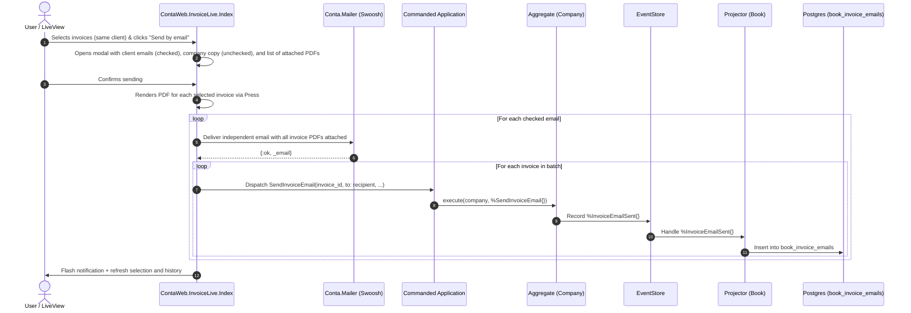

# Design Specification: Invoice Email Delivery with Swoosh, Same-Client Batch Sending, and CQRS/ES Tracking

## 1. Overview

This feature integrates invoice email delivery into Conta using Swoosh. Key capabilities:
1. **Multiple emails per contact**: Store an array of email addresses (`emails: {:array, :string}`) for contacts/clients in the directory.
2. **Company Email Support**: Add `email: :string` to Company info (`SetCompany`, `CompanySet`, `Conta.Aggregate.Company`, `Invoice.Company`).
3. **Single and Batch Invoice Email Sending (Same-Client Batching)**:
   - In `InvoiceLive.Index`, users can select one or more invoices using row checkboxes.
   - The "Send selected by email" ("Enviar facturas por email") button is **enabled only if all selected invoices belong to the same client**.
   - If selected invoices belong to multiple clients, the batch button remains disabled with a clear tooltip/badge explaining that all selected invoices must belong to the same client.
4. **Interactive Modal with Checkbox Selection and PDF Attachments**:
   - Displays each client email as a separate checkbox, **checked by default**.
   - Displays the company email as an additional checkbox ("Send copy to company"), **unchecked by default**.
   - Lists all selected invoice PDFs that will be attached to the email (`#{invoice.invoice_number}.pdf`).
   - Allows customizing Subject and Body (with sensible generic defaults mentioning all included invoices).
5. **Independent Delivery per Recipient**:
   - Each selected recipient receives an independent email message containing all selected invoice PDF attachments.
   - For every invoice and every recipient, a domain event (`InvoiceEmailSent`) is recorded in CQRS/ES.
6. **Delivery Audit History**:
   - Non-printable section (`print:hidden` / `:if={!assigns[:embedded]}`) in the invoice view displaying a table of all past deliveries: Date, Time, Destination Email, Subject.

---

## 2. Architecture & Domain Design (CQRS/ES)

---

## 3. Detailed Component Changes

### 3.1 Company Email Support (`apps/conta`)
- **Command & Event**:
  - `Conta.Command.SetCompany`: adds `field :email, :string`.
  - `Conta.Event.CompanySet`: adds `field :email, :string`.
  - `Conta.Event.InvoiceSet.Company`: adds `field :email, :string`.
- **Aggregate**: `Conta.Aggregate.Company` adds `email: nil | String.t()`.
- **Projector**: `Conta.Projector.Book.Invoice.Company` adds `field :email, :string`.

### 3.2 Contact Multiple Emails (`apps/conta`)
- **Migration**: `add_emails_to_directories_contacts.exs` adds `emails: {:array, :string}, default: []`.
- **Command**: `Conta.Command.SetContact` adds `field :emails, {:array, :string}, default: []`.
- **Event**: `Conta.Event.ContactSet` adds `field :emails, {:array, :string}, default: []`.
- **Aggregate**: `Conta.Aggregate.Company.Contact` adds `field :emails, {:array, :string}, default: []`.
- **Projector**: `Conta.Projector.Directory.Contact` adds `field :emails, {:array, :string}, default: []`.
- **Invoice Client Snapshot**: `Conta.Event.InvoiceSet.Client` & `Conta.Projector.Book.Invoice.Client` add `field :emails, {:array, :string}, default: []`.

### 3.3 Invoice Email Tracking (`apps/conta`)
- **Migration**: `create_book_invoice_emails.exs` creates table `book_invoice_emails`:
  - `id`: `:binary_id`, primary key.
  - `invoice_id`: references `:book_invoices`, type `:binary_id`, on_delete `:delete_all`.
  - `to`: `:string` (single recipient per independent delivery).
  - `subject`: `:string`.
  - `body`: `:text`.
  - `sent_at`: `:utc_datetime_usec`.
  - `timestamps(type: :utc_datetime_usec)`.
- **Command**: `Conta.Command.SendInvoiceEmail`:
  - `id`: binary_id
  - `invoice_id`: binary_id
  - `company_nif`: string
  - `to`: string
  - `subject`: string
  - `body`: string
  - `sent_at`: DateTime
- **Event**: `Conta.Event.InvoiceEmailSent`:
  - `id`: binary_id
  - `invoice_id`: binary_id
  - `company_nif`: string
  - `to`: string
  - `subject`: string
  - `body`: string
  - `sent_at`: DateTime
- **Aggregate**: `Conta.Aggregate.Company`:
  - `execute/2` for `SendInvoiceEmail`: validates invoice exists, `to` is valid email format, emits `InvoiceEmailSent`.
  - `apply/2` for `InvoiceEmailSent`.
- **Read Model**:
  - `Conta.Projector.Book.InvoiceEmail` schema.
  - `Conta.Projector.Book.Invoice` adds `has_many :emails, Conta.Projector.Book.InvoiceEmail, foreign_key: :invoice_id`.
  - `Conta.Projector.Book` handles `InvoiceEmailSent` inserting into `book_invoice_emails`.
  - `Conta.Projector.Rebuild` registers `Conta.Projector.Book.InvoiceEmail` in schemas for `:book`.
  - `Conta.Book.list_invoice_emails(invoice_id)` returns sent emails ordered by `sent_at: :desc`.

### 3.4 Email Dispatching Service with Swoosh (`apps/conta`)
- `Conta.Book.send_invoices_email(invoices, recipient_email, params)`:
  - Generates PDF binary for each invoice in `invoices` via `ContaWeb.InvoiceController.to_pdf/2`.
  - Builds Swoosh email with all PDF attachments:
    - `to`: single recipient `recipient_email`
    - `from`: `{company.name, company.email || Application.get_env(:conta, :mailer_from, "billing@altenwald.com")}`
    - `subject`: customized subject
    - `text_body`: customized body
    - `attachments`: list of `%Swoosh.Attachment{}` (one per invoice)
  - Delivers with `Conta.Mailer.deliver/1`.
  - On success, dispatches `SendInvoiceEmail` command for each invoice in the batch.

### 3.5 Web UI (`apps/conta_web`)
- **Contacts (`ContaWeb.ContactLive`)**:
  - `FormComponent`: input for comma-separated emails.
  - `Index`: displays emails in table.
- **Invoice Listing & Selection (`ContaWeb.InvoiceLive.Index`)**:
  - Checkbox per row for invoice selection.
  - Selection tracking in assigns (`selected_invoice_ids: MapSet.new()`).
  - Batch action bar:
    - If selected invoices > 0 and all belong to the **same client**: button "Enviar X facturas por email" is **enabled**.
    - If selected invoices belong to multiple clients: button is **disabled** with an alert/tooltip: "Todas las facturas seleccionadas deben pertenecer al mismo cliente".
  - Row action `hero-envelope` "Send by email" for single invoice.
- **Send Email Modal (`ContaWeb.InvoiceLive.SendEmailComponent`)**:
  - Handles both single invoice and batch of invoices for the same client.
  - Displays list of invoices to be attached as PDFs with their number, date, and amount.
  - Checkboxes for each client email (checked by default).
  - Checkbox for company copy (unchecked by default).
  - Subject input (default: `Factura(s) ... de #{company.name}`).
  - Body textarea (default mentioning all invoices and total amount).
  - "Send Email" action: dispatches emails independently to each checked recipient.
- **Invoice HTML / Print View (`ContaWeb.InvoiceController` / `invoice_html/show.html.heex`)**:
  - In browser view (`:if={!assigns[:embedded]}` with `print:hidden`):
    - Top action bar with "Send by email" and "Download PDF".
    - Non-printable box with **Historial de envíos por email (Email Delivery History)** table:
      - Date & Time
      - Destination Email (`to`)
      - Subject
